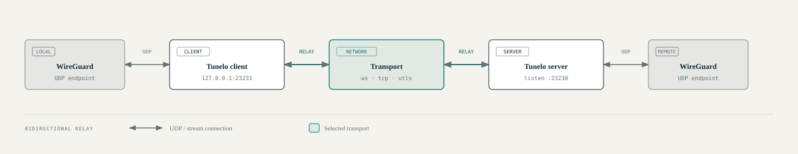

# tunelo

## Description

__tunelo__ encrypts and tunnels UDP traffic (e.g. WireGuard) over a transport protocol
like websocket or TCP. Helping to use VPNs in restricted areas.

## Table of Contents

- [Server](#server)
  - [Requirements](#server-requirements)
  - [Configure NAT rules on Linux](#Configure-NAT-rules-on-Linux)
  - [Enable IP Forwarding on Linux](#Enable-IP-Forwarding-on-Linux)
  - [Server WireGuard Config](#Server-WireGuard-Config)
  - [Run Server WireGuard](#Run-Server-WireGuard)
  - [Run Proxy Server](#Run-Proxy-Server)
- [Client](#client)
  - [Client Requirements](#Client-Requirements)
  - [Client WireGuard Config](#Client-WireGuard-Config)
  - [Run Proxy Client](#Run-Proxy-Client)
- [License](#license)
- [Project documentation](docs/README.md)
- [Architecture](docs/architecture.md)
- [Configuration reference](docs/configuration.md)
- [Development](docs/development.md)
- [Security notes](docs/security.md)

## Quick start

`tunelo` forwards UDP traffic between a local VPN endpoint and a remote proxy over WebSocket, TCP, or a TLS connection whose client hello is shaped with uTLS. It is intended to carry traffic such as WireGuard through networks where direct UDP connectivity is restricted.

The repository builds two separate Go programs: `server/` runs beside the server-side VPN endpoint, and `client/` runs beside the client-side endpoint. Both default to WebSocket mode. Start the server first, then start the client with the matching transport and addresses.

```powershell
go build -o tunelo-server ./server
go build -o tunelo-client ./client
```

See [docs/configuration.md](docs/configuration.md) for flags and protocol-specific setup, and [docs/architecture.md](docs/architecture.md) for the data path and system diagram. In `utls` mode the server also needs `cert.pem` and `key.pem` in its working directory. The current client skips certificate verification; review [docs/security.md](docs/security.md) before exposing a listener or relying on this mode.

## Project documentation

- [Documentation index](docs/README.md)
- [System overview and architecture diagram](docs/architecture.md) ([HTML](docs/architecture.html), [SVG](docs/architecture.svg))
- [Configuration and deployment](docs/configuration.md)
- [Development and repository layout](docs/development.md)
- [Security notes and current limitations](docs/security.md)



## Server

### Server Requirements

- Install WireGuard
- Install Go Compiler
- Configure NAT rules
- Enable IP Forwarding

### Configure NAT rules on Linux

This iptables command is adding a NAT rule that masquerades (changes) the source IP address of
packets originating from the specified source network (10.8.0.0/24) to match the public IP address
of the router/firewall when those packets are leaving the system. This is commonly used in
scenarios where you have a private network behind a NAT gateway or firewall, and you want the
internal devices to access the internet using the public IP address of the gateway.

After running the following command, you can install the iptables-persistent package using apt to
make the rule persistent.

``` shell
$ iptables -A POSTROUTING -t nat -s 10.8.0.0/24 -j MASQUERADE
```

### Enable IP Forwarding on Linux

The following command is used to enable IP forwarding on a Linux system. IP forwarding is a feature
that allows a Linux system to route traffic between different network interfaces or subnets.

After running the following command, you can edit the /etc/sysctl.conf and set the
net.ipv4.ip_forward parameter to 1. Then run sysctl -p to make the IP forwarding persistent.

``` shell
$ echo 1 > /proc/sys/net/ipv4/ip_forward
```

### Server WireGuard Config

This is the WireGuard config you should apply in the server that the __tunelo__ server 
will run. Save this config in /etc/wireguard/wg0.conf

Make sure to replace the private and public keys.

``` WireGuard
# Server
[Interface]
PrivateKey = 
Address = 10.8.0.1/24
MTU = 1450
ListenPort = 23233
SaveConfig = false
DNS = 1.1.1.1
DNS = 8.8.8.8

# Phone
[Peer]
PublicKey = r8KQuA7mtVVpHwDY6vTFmeMBcn+Y7omh6EPWroMWcD8=
AllowedIPs = 10.8.0.2/32
```

### Run Server WireGuard

```shell
$ wg-quick up wg0.conf
```

### Run Proxy Server

Clone the repository and navigate to the server directory and build.

```shell
$ go build -o tunelo .
```

Run the proxy server by specifying ip and port settings.

```shell
$ ./tunelo -help
```

## Client

### Client Requirements

- Install WireGuard
- Install Go Compiler

### Client WireGuard Config

You can use the WireGuard Android app to apply these settings. you need to replace the
PrivateKey and the PublicKey.

It needs to exclude the __tunelo__ server IP or exclude the __termux__ app in
which the __tunelo__ client runs on.

The Endpoint in the peer part is pointing to the __tunelo__ client running on the phone.

``` WireGuard
[Interface]
Address = 10.8.0.2/32
DNS = 1.1.1.1
ExcludedApplications = com.termux
ListenPort = 23233
MTU = 1450
PrivateKey = 

[Peer]
AllowedIPs = 0.0.0.0/0
Endpoint = 127.0.0.1:23231
PersistentKeepalive = 25
PublicKey = D4PLMnAoDuXcgj7iTzyLs7NRptTND+z8vmxYA4Af218=
```

### Run Proxy Client

Clone the repository on client and navigate to client directory, build, and run.

Make sure to provide your ip/port settings using the flags.

```shell
$ tunelo -help
```

## License

MIT
